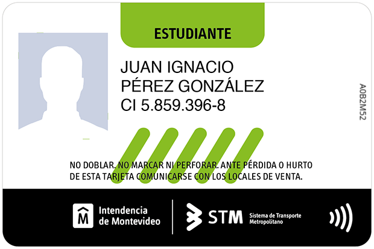

# tini-ocr-stm

This tool was used for a course project. It allows the user to perform OCR on an student STM card (Metropolitan Transport System Card in Uruguay).
You can use it with a video camera in real time (main.py), or modifying the path of image file on src/staticimg.py (staticimg.py)

## Example

#### 
Input:

#### Output:
>{'name': 'JUAN IGNACIO', 'surname': 'PÉREZ GONZÁLEZ', 'id': '5.859.396-8', 'card_code': 'A0B2M52'}
